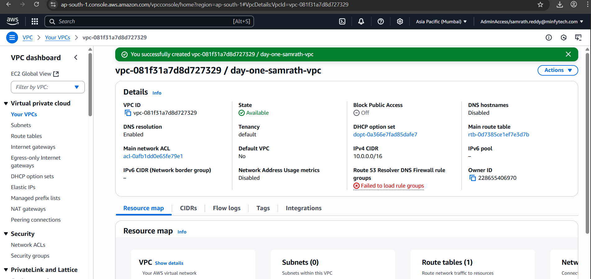
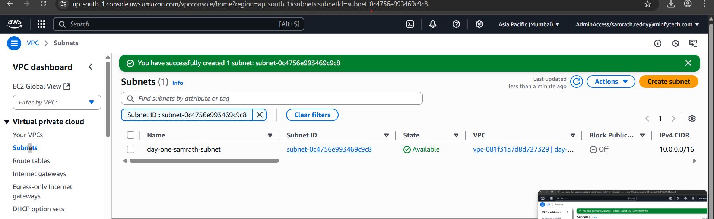
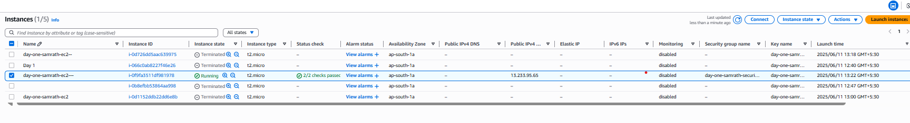
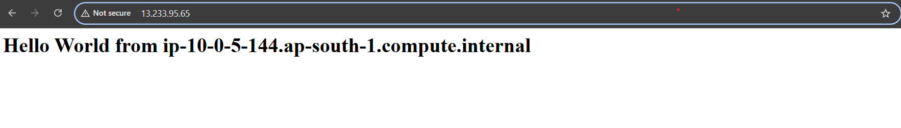

# Day 1 (AWS)

## - In Office
### Key Value pair
- Created a key value pair with name "day-one-samrath-kp"


### VPC
- Created a vpc only with name "day-one-samrath-vpc"


### Internet gateway
- Created a Internet gateway with name "day-one-samrath-ig"
- then attach it to the vpc 


### Subnet
- Created subnet with name "day-one-samrath-subnet" in the vpc we have created


### Route table
- Created a route table with name "day-one-name-routetable" in the vpc we have created
- after creating go to routes -> add routes -> source is 0.0.0.0/0 and target is internet gateway that we have created
- edit the subnets and add this route table to it 
- In image below the  0.0.0.0/0 has got missing due to crop while screenshotting


### security group
- Created security group  with name "day-one-samrath-securitygroup"  in the vpc we created and add inbound rule http traffic i.e 80 Port
- In the image below inbound rules it is not added while screenshoting but it is added in real implementation

### Instance
- Created instance with name "day-one-samrath-ec2--"
- use the existing vpc and subnet and enable public ip and upload the code
```bash
  #!/bin/bash
yum update -y
yum install -y httpd
systemctl start httpd
systemctl enable httpd
echo "<h1>Hello World from $(hostname -f)</h1>" > /var/www/html/index.html
```

  
- after configuring everything try to access it with wer instance ip we should get the following output


## - take home assignment
- Created a key value pair
- Created a vpc
- Created a Internet gateway
- then attach it to the vpc
- Created 2 subnets named public-subnet and private-subnet
- Created  routes tables for each subnet or Created for public-subnet and use default for private-subnet
- after creating edit the subnet assoiciation and attach it to that respective subnets 
- for the route table of public-subnet go to edit routes -> add routes -> source is 0.0.0.0/0 and target is internet gateway that we have created this makes the public-subnet public 
- Created security group in the vpc we created named webapp-sg and allow https and http traffic and ssh also 
- Created security group in the vpc we created named database-sg and allow mysql/aurora and put the security group of webapp
- Created 2 instances one in public-subnet and one in private subnet named web-server and db-server respectively


for ping part in private we need to add inbound value ICMP type to get ping request
